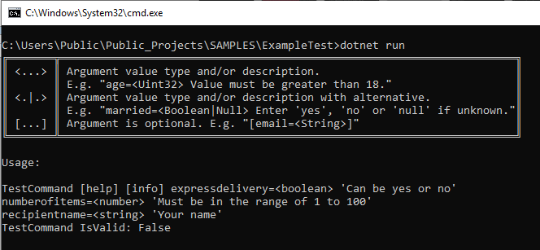

# Command Line Helper

This library is an implementation of a command line interpreter.

The primary goal of this library ist to simplify the processing
of command line arguments in [CLI](#CLI) programs as well as unifying
the [CLI](#CLI) interfaces on windows and linux systems.

## Table of contents

- [Command Line Helper](#command-line-helper)
  - [Table of contents](#table-of-contents)
  - [Motivation](#motivation)
  - [Installation](#installation)
  - [Project Setup](#project-setup)
  - [Usage](#usage)
    - [The Basics](#the-basics)
    - [Enhancing parameter properties with attributes](#enhancing-parameter-properties-with-attributes)
      - [Class attributes](#class-attributes)
      - [Property Attributes](#property-attributes)
    - [Advanced parsing and validating](#advanced-parsing-and-validating)
      - [Overview](#overview)
      - [Enhanced parsing](#enhanced-parsing)
      - [Enhanced validation](#enhanced-validation)
    - [Create or modify screens](#create-or-modify-screens)
    - [Technical documentation](#technical-documentation)
    - [Class documentation](#class-documentation)
    - [Design decisions](#design-decisions)
  - [Licensing](#licensing)
  - [Glossary](#glossary)

## Motivation

Command line interface programs experienced a renaissance over the last couple of years. On windows systems they were practically dead after the switch from Win98 to XP.

On linux systems on the other hand they are and were always first class members of the operation system. Even in modern linux distributions, which offer a graphic user interfaces which can easily compete with the windows user interface, some task are much easier done with some [shell](#SHELL) knowledge than done by using the [GUI](#GUI) counterparts.  

The uprising of [headless](#HEADLESS) [OS](#OS) installations on virtualization environments like docker, on embedded system or as bare-metal server installation brought a huge uplift to command line interfaces.  

It is still not something a typical windows user has to worry about. But for programmers there is no way around it any more.

Since I'm a programmer myself, I realized that I implemented the command line parsing and validation logic over and over again for different command line programs. It's a mundane task which still needs a lot of code for a proper implementation. In order to shorten the time spend for that task and make the command line programs look more unique and professional, I created this library.  

Unfortunately there are no recommendations for a 'good' [CLI](#CLI) interface. You can find tons of books and documents which tell how to create a nice and practical graphic user interface design. Recommendations for [CLI](#CLI) interfaces simply don't exist. For that reason you can find plenty command line programs which offer interfaces which basically try to repel everyone from using them   .  
If you don't know what I'm talking about try this. Open a shell on a linux OS of your choice and enter the following command:

``` bash
compgen -A function -abck
```

I get a list of over 2000 commands. Most of them have names which sound like some kind of ancient Klingon dialect. Those names tell nothing about the purpose of the commands. The 'compgen' command itself is one of this commands. Even the help for the 'compgen' command doesn't bother to tell what's the meaning of 'compgen' is.  

How often did it happen to you that you have to ask a search engine which command to use to solve a simple problem, because you couldn't figure out which of the myriad of commands available on your system is the one to use.  

That workflow is generally accepted but totally stupid. If the commands sub-commands and arguments / options would have self explaining names, you would be able to use your system without the support of a search engine.  

There seems to be some kind of competition between command line program programmers. If you want to participate in that competition follow this simple rules:

1. You command names should be abbreviated to be meaningless garbage.  
2. Command line arguments must not tell anything about their purpose. Try to shorten them to less than 3 characters and make them as hard to memorize as possible.
3. If possible try to come up with a bunch of sub-commands and mutual exclusive command line arguments.
4. Make sure your command line arguments have different meaning when they are written in upper-case or lower-case.
5. Make sure that no one without a solid regular expression experience will be able to decipher your help printout.

I call this rules the "***BAD CLI PROGRAM COMPETITION RULES***".

I could present an endless list of examples. But I'm pretty sure you will make your own experiences over time.

There are already other projects which thrive to improve the command line interface. A search for **command line** at nuget gives you more than 3000 results. Obviously there are other programmers who think that the way command line interfaces are handled today need some improvement. I tried a lot of those libraries but they were all disappointing. Most of them were poorly documented or even worse, not documented at all. Others were totally overdeveloped and none of the libraries made an effort to deal with the general problems of command line interfaces. They still followed the "***BAD CLI PROGRAM COMPETITION RULES***" described earlier as if it were a religious commandment.

So I decided to crate my own solution and follow my own rules which are:

1. Keep it simple. (As in keep it simple for the user and programmer)
2. Same behavior on windows and linux systems. (That means also no case sensitive arguments)
3. Easy to understand. (A small set of simple rules)
4. Easy to extend.
5. Well tested.
6. Well documented.

## Installation

Add the nuget package to your project using the following command:

```bash
dotnet add package CommandLineHelper
```

Add a *'using'* statement to your code file:

```cs
using CommandLineHelper;
```

## Project Setup

The project is a dotnet core class library project. The project is compiled against the
**netcoreapp3.X** target framework.  
I used the VSCode IDE in version 1.41.1 and tested the solution on windows 10 and Ubuntu 18.04.

If your development environment matches the latter described environment you won't have any
trouble to compile the project yourself. To do so follow this easy steps.

1. Open a shell and type the following command:
``` bash 
git clone https://github.com/lord-saumagen/CLIHelper.git
```
2. Change into the new created directory and type:
``` bash 
dotnet build
```
3. Run the tests to see if everything works as expected. 
``` basch
dotnet test
```
4. Reference the CommandLineHelper project in your own project.
``` bash 
dotnet add reference <Path to the 'CommandLineHelper' project>
```

The repository at https://github.com/lord-saumagen/CLIHelper.git is a multi project solution. Since github doesn't support multi project solutions, the sub-projects are simply directories below the *'CLIHelper'* directory.  
The *'CLIHelper'* directory hosts the solution file for this multi project solution. (Blue)  
The *'CommandLineHelper'* directory is the director which hosts the library implementation. (Black)  
The *'CommandLineHelperUnitTest'* directory hosts the unit tests. (Orange)  
The other directories are all part of the integration test. (Green)  

The directory structure looks like this:


## Usage

### The Basics

The most important part of the solution is the [ParameterBase](./CommandLineHelper/docs/markdown/CommandLineHelper.ParameterBase.md) class. Create a subclass which inherits from ParameterBase and add public read / write properties to that class. Those public properties will become the command line arguments of your command line application. I will call them **parameter properties** from now on. I call the classes which derive from [ParameterBase](./CommandLineHelper/markdown/CommandLineHelper.ParameterBase.md) **parameter classes** accordingly.

In a second step you have to change the 'Main' function of your command line program. Lets say you created a 'ParameterObject' class which derived from 'ParameterBase'. In order to benefit from that class create a new instance of that class in your 'Main' function. The constructor requires your program name as it is used on the command line. That name might differ from the program name you use during development. But in most cases it's the same. As a second parameter a reference to an assembly is required. That should be the assembly which hosts your program. The assembly reference is used to determine the program version. I will come to that later.

In a third step call the 'Process' function on the 'ParameterObject' instance. The function requires the arguments which were provided in the 'Main' function as a first parameter. The second parameter is a boolean and tells if you want to show the 'usage' screen if the arguments array didn't offer at least one argument which qualified as argument for this interpreter.

The 'Main' function should look like this now:

``` cs
    static int Main(string[] args)
    {
      bool IsValid;
      ParameterObject parameterObject = new ParameterObject("TestCommand", Assembly.GetExecutingAssembly());
      IsValid = parameterObject.Process(args, showUsageOnEmptyArgs : false);
```

The [Process](./CommandLineHelper/docs/markdown/CommandLineHelper.ParameterBase.Process.md) function parses the arguments from the provided argument array and assigns them to the corresponding parameter properties. After that the parameter properties get validated. The result of the validation will be true if all parameter properties passed the validation or otherwise false. The result will also be false if the parser detected a help or version request. You will read about that later. The parsing and validation process works for booleans, most number formats and strings. If you need more complex capabilities you have to implement your own parsing and validation logic. You can read about it in the [Advanced parsing and validating](#advanced-parsing-and-validating) section.

Here is an example of the most basic usage of the command line helper library:

``` cs
using System;
using CommandLineHelper;
using System.Reflection;

namespace TestCommand
{
  //
  // Create the parameter class and add some public read / write
  // properties.
  //
  public class ParameterObject : ParameterBase
  {

    public Boolean ExpressDelivery {get; set;}
    public int NumberOfItems { get; set; }
    public String RecipientName { get; set; }


    public ParameterObject(string commandName, Assembly commandAssembly):
    base(commandName, commandAssembly, new DisplayHelper())
    {
    }

  }// END class


  class TestCommand
  {
    public static ParameterObject parameterObject;

    public static int Main(string[] args)
    {
      bool IsValid;
      //
      // Create an instance of the parameter class.
      //
      parameterObject = new ParameterObject("TestCommand", Assembly.GetExecutingAssembly());

      //
      // Call the 'Process' function and evaluate the
      // the validation result.
      //
      IsValid = parameterObject.Process(args, showUsageOnEmptyArgs : false);
      Console.WriteLine($"\r\n\r\nTestCommand IsValid: {IsValid}");

      if(IsValid)
      {
         //
         // Here is the place where your own program logic should
         // start. At this point you have a valid parameter object.
         // Access the validated command line arguments through
         // the 'ParameterObject' instance which holds the
         // parameter properties.
         //
         return 0;
      }
      else
      {
        //
        // Don't bother to start your program. Something
        // went wrong during parsing or validation.
        // Return an error code and terminate.
        //
        return 1;
      }
    }


  }// END class
}// END namespace
```

The example 'ParameterObject' has three public read / write properties. Those will become the arguments of the 'TestCommand' program. Running that program as it is will give you the following result:


OK, that might not be what you expected. Stay with me and soon you will be enlightened. But first lets see what happens if you set the 'showUsageOnEmptyArgs' in the 'Process' function to true.  
The result when calling the command line program without any arguments will look like this:


First you will notice that there is a generic usage screen created by the program. (That's what the 'showUsageOnEmptyArgs' flag is used for)  

Second you will notice that the function returned false as result. The logic behind that is, that the arguments are considered invalid if an output screen was created.

Third you might notice that there are two special arguments called 'help' and 'version' which are not defined in the 'ParameterObject' class. They are part of the base class and for that reason they will always be listed as the first parameters in the parameter list.

And fourth you might notice that all arguments are optional. Thats what the character explanation marked in read means. The usage line looks like:

``` bash
TestCommand [help] [version] [ExpressDelivery=<Boolean>]
[NumberOfItems=<Int32>] [RecipientName=<String>]
```

Since all arguments are optional, calling the program without any argument will be perfectly valid. Except for the case where you have set the 'showUsageOnEmptyArgs' flag to true. In that case at least one valid argument must be provided in order to pass the validation. Even if all arguments are optional.

You might think that's stupid, but there is a well known use case for it. Often people enter only the command name without any parameter because they expect to see a usage screen which tells them what arguments are available. I do it regularly because I can't possibly memorize all stupid named arguments of all command line programs in my tool belt.

On the other hand, if someone provides the right name and value for at least one of the arguments, you can assume that the person was able to memorize the arguments. In that case there is no need to show the usage screen.

But some commands, like the dir / ls command or the netstat command, will also run without any argument provided. Those commands have either a set of valid default values or they simply don't need any arguments for their basic function.  
If you intend to create a command line program which does have parameter defined but doesn't need them for the basic function set the parameter to false. Otherwise set the parameter to true and show the user which parameters are supported by your program.

Let's have a quick look at the 'help' and the 'version' screen. Run the program and add the 'help' argument to render the help screen. The screen looks like:


The help screen shows a generic help in the upper part and the usage screen in the lower part. The generic help lists all arguments, their type and if available their default value. If the parameter property has a [DescriptionAttribute](./CommandLineHelper/docs/markdown/CommandLineHelper.DescriptionAttribute.md) attached, that description will be displayed in the 'Description' column. Otherwise it's simply the name and the type.

Run the program and add the 'version' argument to render the version screen. The screen looks like:


The version screen simply returns the version of the command line program. The version is taken from the assembly which hosts the command line program. That's why the constructor of the [ParameterBase](./CommandLineHelper/docs/markdown/CommandLineHelper.ParameterBase.md) class requires a reference to the program assembly.

You set the version of your program in the '*.csproj' file using the '&lt;Version&gt;' tag.

Please notice that the result of the validation is always false if a screen was shown during the execution of the 'Process' function.

There is one more screen which you haven't seen yet. That's the validation summary screen which is shown when the parsing and / or validation failed.

To get a better understanding and a little insight lets change the program and add a function which dumps some internal state variables.

The program should look like this:

``` cs
using System;
using CommandLineHelper;
using System.Reflection;

namespace TestCommand
{
  public class ParameterObject : ParameterBase
  {

    public Boolean ExpressDelivery {get; set;}
    public int NumberOfItems { get; set; }
    public String RecipientName { get; set; }


    public ParameterObject(string commandName, Assembly commandAssembly): 
    base(commandName, commandAssembly, new DisplayHelper())
    {
    }

  }// END class

  class TestCommand
  {
    public static ParameterObject parameterObject;

    public static int Main(string[] args)
    {
      bool IsValid;
      parameterObject = new ParameterObject("TestCommand", Assembly.GetExecutingAssembly());
      IsValid = parameterObject.Process(args, showUsageOnEmptyArgs : false);
      Console.WriteLine($"\r\nTestCommand IsValid: {IsValid}\r\n\r\n");
      Dump(parameterObject);

      if(IsValid)
      {
         //
         // Here is the place where your own program logic should
         // start. At this point you have a valid parameter object.
         // Access the validated command line arguments through
         // the 'ParameterObject' instance which holds the
         // parameter properties.
         //
         return 0;
      }
      else
      {
        //
        // Don't bother to start your program. Something
        // went wrong during parsing or validation.
        // Return an error code and terminate.
        //
        return 1;
      }
    }

    public static void Dump(ParameterBase parameterObject)
    {
      string printString;

      if(parameterObject == null)
      {
        return;
      }

      printString = "ParameterObject\r\n{\r\n"; 
      printString += "//\r\n";
      printString += "// PARAMETER PROPERTIES\r\n";
      printString += "//\r\n";
      printString += "\r\n";
      foreach(PropertyMetaInfo propertyMetaInfo in parameterObject.PropertyMetaInfoList)
      {
        printString += "  " + propertyMetaInfo.PropertyInfo.Name + " : " + 
        (propertyMetaInfo.PropertyInfo.GetValue(parameterObject)?.ToString() ?? "null") + ";\r\n";
      }

      printString += "\r\n";
      printString += "//\r\n";
      printString += "// PROPERTY META INFOS\r\n";
      printString += "//\r\n";
      printString += "\r\n";
      foreach(PropertyMetaInfo propertyMetaInfo in parameterObject.PropertyMetaInfoList)
      {
        printString += "  " + propertyMetaInfo.Name + "\r\n  {\r\n";
        printString += "    IsValid : " +  propertyMetaInfo.IsValid.ToString() + ";\r\n";
        printString += "    ParseResult : " +  propertyMetaInfo.ParseResult.ToString() + ";\r\n";
        printString += "  }\r\n";
      }

      printString += "\r\n";
      printString += "//\r\n";
      printString += "// PARSED ARGUMENTS\r\n";
      printString += "//\r\n";
      printString += "\r\n";
      foreach(var item in parameterObject.Arguments)
      {
        printString += "  " + item.Key + " : " + item.Value + ";\r\n";
      }

      printString += "}\r\n"; 
      Console.Write(printString);
    }

  }// END class
}// END namespace
```

Now run the program with the following arguments:

``` bash
ExpressDelivery=Why numberofitems=many RECIPIENTNAME=42
```

The result screen should look like this:


The red part is the validation summary which will be shown if the validation failed. That is the last of the screens which you get out of the box. Later I will show you how to create your own screen. But for the moment lets concentrate on the result. 
As you can see, all arguments were recognized despite the fact that one was written in all upper characters, one in all lower characters and one in pascal case. As I mentioned earlier, the parser isn't case sensitive.

The 'ExpressDelivery' argument is marked as invalid for the following reason. The value of the argument was 'Why' but the parameter property has a boolean type. Since the cast of the 'Why' string to boolean failed, the argument is considered invalid.

The 'NumberOfItems' argument is marked as invalid for the same reason.
The cast of the argument value 'many' to an integer failed.

But the 'RecipientName' argument is considered valid even with a value of '42' which is clearly a number. The reason for that is, that every argument provided in the 'args' array is a string. Because the 'args' array is defined as a string array. That means the value of the 'RecipientName' argument is the string '42' which is obviously type compatible with the parameter property type which is also a string.

As you can see in the 'PARAMETER PROPERTIES' section of the screen above, the 'ExpressDelivery' parameter property hast still the default value 'False'. The 'NumberOfItems' parameter property has still the default value '0', but the 'RecipientName' parameter property has a value of '42'.

The [PropertyMetaInfo](./CommandLineHelper/docs/markdown/CommandLineHelper.PropertyMetaInfo.md) collection on the 'ParameterObject' class gives you a deeper insight on what happened during parse or validation. You can see that the parse failed for the 'ExpressDelivery' and the 'NumberOfItems' and succeeded for the 'RecipientName'.

The last part, the 'PARSED ARGUMENTS' part shows a dictionary which holds the arguments which qualify as arguments for the 'CommandLineHelper' library.

That are all arguments which follow the 'ArgumentName'='ArgumentValue' rule. There is no space allowed between the argument name the equal sign and the argument value. Arguments which don't follow that rule will be ignored.

The 'PropertyMetaInfo' collection and the arguments dictionary will become of interest as soon as you start to create your own parsing or validation rules.

All the screens which might be generated during the 'Process' function are part of the [DisplayHelper](./CommandLineHelper/docs/markdown/CommandLineHelper.DisplayHelper.md) class which itself is a reference implementation of the [IDisplayHelper](./CommandLineHelper/docs/markdown/CommandLineHelper.IDisplayHelper.md) interface. The class was assigned to the 'ParameterObject' in the call to the base constructor.

``` cs
base(commandName, commandAssembly, new DisplayHelper())
```

So far for the basic part of the 'CommandLineHelper' library.

You might argue that this was a lot for creating a command line program which only has three arguments to parse and to validate. But be honest, it was a lot to read but not a lot to program. The programming part was just the creation of a parameter property class which derives from [ParameterBase](./CommandLineHelper/docs/markdown/CommandLineHelper.ParameterBase.md). Creating an instance of that class and calling the [Process](./CommandLineHelper/docs/markdown/CommandLineHelper.ParameterBase.Process.md) function.

The help screen, usage screen, version info, and the validation summary comes out of the box. Implementing the parse and validation logic from scratch would be much more code to write.  

On the other hand the validation so far was far from perfect. The 'NumberOfItems' argument will still accept negative values. The 'RecipientName' will accept any nonsense and you might as well like to have mandatory arguments.

Even the help screen and the usage screen might need some improvement.

If that are the questions that bother you I would strongly recommend to read the next sections.

### Enhancing parameter properties with attributes

The 'CommandLineHelper' library provides some attributes which can be used to enhance the basic behavior of the parameter classes.
Two of them are class attributes. 10 of them are property attributes.

#### Class attributes

1. [HelpAttribute](./CommandLineHelper/docs/markdown/CommandLineHelper.HelpAttribute.md)
2. [UsageAttribute](./CommandLineHelper/docs/markdown/CommandLineHelper.UsageAttribute.md)

The intended use is to attach them to a parameter class.  

Here is an example:

``` cs
namespace TestCommand
{

  [Help(@"The TestCommand command line program is intentionally
  created to test some aspects of the 'CommandLineHelper' library.
  The program itself doesn't do anything except for writing to the
  command line output stream.
  Feel free to use this program as a starting point for your own
  command line program.")]  
  public class ParameterObject : ParameterBase
  {

    public Boolean ExpressDelivery {get; set;}
    .
    .
    .
```

The text provided in the [HelpAttribute](./CommandLineHelper/docs/markdown/CommandLineHelper.HelpAttribute.md) constructor will become part of the help screen if you use the [DisplayHelper](./CommandLineHelper/docs/markdown/CommandLineHelper.DisplayHelper.md) class in your 'ParameterClass'. The text will be shown on top of the generic help screen.


---

The [UsageAttribute](./CommandLineHelper/docs/markdown/CommandLineHelper.UsageAttribute.md) should be used the same way. The text assigned to the [UsageAttribute](./CommandLineHelper/docs/markdown/CommandLineHelper.UsageAttribute.md) will replace the usage string of the generic usage screen.

Here is an example:

``` cs
namespace TestCommand
{

  [Usage("TestCommand [help] [info] expressdelivery=<boolean>
  'Can be yes or no' numberofitems=<number> 'Must be in the range
  of 1 to 100' recipientname=<string> 'Your name'")]  
  public class ParameterObject : ParameterBase
  {

    public Boolean ExpressDelivery {get; set;}
    .
    .
    .
```

The result looks like this:



As long as you use the [DisplayHelper](./CommandLineHelper/docs/markdown/CommandLineHelper.DisplayHelper.md) class in your parameter object, the text will be shown below the character explanation in the usage screen. That means you better stick with the conventions for marking optional arguments, value types and so on in your usage text. (In the example above I didn't. I made all arguments mandatory in the usage string. Just to show that it is your responsibility to create a valid and meaningful usage text and how you can mess it up.)

Of course you can assign both attributes at the same time to your parameter class.

#### Property Attributes

1. [DefaultValueAttribute](./CommandLineHelper/docs/markdown/CommandLineHelper.DefaultValueAttribute.md)
2. [DescriptionAttribute](./CommandLineHelper/docs/markdown/CommandLineHelper.DescriptionAttribute.md)
3. [InternalAttribute](./CommandLineHelper/docs/markdown/CommandLineHelper.InternalAttribute.md)
4. [MandatoryAttribute](./CommandLineHelper/docs/markdown/CommandLineHelper.MandatoryAttribute.md)
5. [MaxStringLengthAttribute](./CommandLineHelper/docs/markdown/CommandLineHelper.MaxStringLengthAttribute.md)
6. [MaxValueAttribute](./CommandLineHelper/docs/markdown/CommandLineHelper.MaxValueAttribute.md)
7. [MinStringLengthAttribute](./CommandLineHelper/docs/markdown/CommandLineHelper.MinStringLengthAttribute.md)
8. [MinValueAttribute](./CommandLineHelper/docs/markdown/CommandLineHelper.MinValueAttribute.md)
9. [NameAttribute](./CommandLineHelper/docs/markdown/CommandLineHelper.NameAttribute.md)
10. [ValueSetAttribute](./CommandLineHelper/docs/markdown/CommandLineHelper.ValueSetAttribute.md)

The [DefaultValueAttribute](./CommandLineHelper/docs/markdown/CommandLineHelper.DefaultValueAttribute.md) gives the property the attribute is attached to a default value. As you might know, value types already have a default value. For number types the default value is 0, for booleans the default value is false. Strings and  reference types don't have a default value. Their value is null as long as they are uninitialized.

Often enough those default values doesn't match your needs. Let's stick with the example program where the 'NumberOfItems' property has a default value of 0. Since the most popular use case in this order command line application is the order of one item, it would be nice to set this value as default. You can do this by attaching the [DefaultValueAttribute](./CommandLineHelper/docs/markdown/CommandLineHelper.DefaultValueAttribute.md) to the 'NumberOfItems' property.

``` cs
[Default(1)]
public int NumberOfItems { get; set; }
```

As with all parameter properties which have a default value, those properties are obviously optional since they already have a valid value assigned. The change of the default value is visible in the help screen and the generic usage screen. It's also the value which will be assigned to the 'NumberOfItems' parameter property after parse, if the argument wasn't provided in the arguments array.

The help screen will look like this:

")

---

The [DescriptionAttribute](./CommandLineHelper/docs/markdown/CommandLineHelper.DescriptionAttribute.md) can be used to add a meaningful description to a parameter property. That description will be shown in the help screen in the description column.

Here is an example:

``` cs
[Default(1)]
[Description(@"The number of items you order for your next delivery.
That number must be greater or equal 1 and less or equal 100.")]
public int NumberOfItems { get; set; }
```

The help screen will look like this:

")

---

The [InternalAttribute](./CommandLineHelper/docs/markdown/CommandLineHelper.InternalAttribute.md) excludes a property of a parameter class, which otherwise qualifies as parameter property, from the parameter property handling. That means the property will not become a command line argument and will therefore not take part in the parse and validation process.
That attribute is only of interest if you intent to implement some logic in the parameter class which requires a public read / write property. If that property shall not become a parameter property attach the [InternalAttribute](./CommandLineHelper/docs/markdown/CommandLineHelper.InternalAttribute.md)
to it.

Here is an example:

``` cs
[Internal]
public int NotAParameter { get; set; }
```

The [InternalAttribute](./CommandLineHelper/docs/markdown/CommandLineHelper.InternalAttribute.md) is a marker attribute and doesn't have an argument.

---

The [MandatoryAttribute](./CommandLineHelper/docs/markdown/CommandLineHelper.MandatoryAttribute.md) marks a parameter property as mandatory. Properties marked as mandatory must be part of the arguments collection. Otherwise the validation will fail. A mandatory parameter property which also has a default value is not longer mandatory for obvious reasons.

Let's change the 'ExpressDelivery' parameter property from the example program. First make the type a nullable boolean. That way the property gets a 'null' as default value. Next add the Mandatory attribute. And just to make it complete, add a description.

``` cs
[Mandatory]
[Description(@"Enter yes if you prefer an express delivery. The delivery will be performed the nex workday.
Enter no if you prefer a normal delivery. The delivery will be performed during the next 4 workdays.")]
public Boolean? ExpressDelivery {get; set;}
```

The help screen will look like this:


Running the program without the mandatory argument will give you this result:


That is because a 'null' value is not accepted as default value for a mandatory parameter property.

---

The [MaxStringLengthAttribute](./CommandLineHelper/docs/markdown/CommandLineHelper.MaxStringLengthAttribute.md) constraints the input of the attached string parameter property to the length given in the attribute constructor. The constructor requires also an error message string. That message will be shown if the string length of the attached parameter property exceeds the allowed length.

Here is an example:

``` cs
[CommandLineHelper.MaxStringLength(10, "The number of characters in
the 'recipientname' argument exceeds the maximum length of 10
characters.")]
public String RecipientName { get; set; }
```

Calling the test program with an invalid long value on the 'RecipientName' leads to this result:


---

The [MaxValueAttribute](./CommandLineHelper/docs/markdown/CommandLineHelper.MaxValueAttribute.md) constraints the input of the attached number parameter property to the value given in the attribute constructor. The constructor requires also an error message string. That message will be shown if the value of the attached parameter property exceeds the maximum value.

---

The [MinStringLengthAttribute](./CommandLineHelper/docs/markdown/CommandLineHelper.MaxStringLengthAttribute.md) constraints the input of the attached string parameter property to the length given in the attribute constructor. The constructor requires also an error message string. That message will be shown if the string length of the attached parameter property undercuts the minimum length.

---

The [MinValueAttribute](./CommandLineHelper/docs/markdown/CommandLineHelper.MinValueAttribute.md) constraints the input of the attached number parameter property to the value given in the attribute constructor. The constructor requires also an error message string. That message will be shown if the value of the attached parameter property undercuts the minimum value.

---

The [NameAttribute](./CommandLineHelper/docs/markdown/CommandLineHelper.NameAttribute.md) gives you the opportunity to create an alias for the parameter properties which will be use on the command line. That might be necessary if you have to follow strict naming conventions in your style guides. Such conventions often lead to lengthy identifiers. That's a good thing for code quality but is a pain for persons who have to type that names as command line arguments. In order to make your command line program easier to use create an alias for the parameter properties which can be shorten without loosing their meaning.    
Let's do it for the 'RecipientName' in the test program. Don't forget to change the error message of the [MaxStringLengthAttribute](./CommandLineHelper/docs/markdown/CommandLineHelper.MaxStringLengthAttribute.md) attribute to reflect the new name. Since we already working on the 'RecipientName' let's make it complete and give the parameter property a description.

Here is an example:

``` cs
[Name("name")]
[CommandLineHelper.MaxStringLength(10, "The number of characters in the 'name' argument exceeds the maximum length of 10 characters.")]
[Description("The name of the person who ordered. The name must not exceed the length of 10 characters.")]
public String RecipientName { get; set; }
```

This name will now be used on the command line to set the value for the 'RecipientName' parameter property. The name will also be use in the help screen or the generic usage screen.

The help screen will look like this:


---

The [ValueSetAttribute](./CommandLineHelper/docs/markdown/CommandLineHelper.ValueSetAttribute.md) constraints the input of the attached parameter property to the elements defined in the attribute constructor. Creating a value set for a parameter property of type string could look like this:

``` cs
    [ValueSet(new object[] {"Left", "Right", "Top", "Down"})]
    public string StringSet
    {
      get;
      set;
    }
```

Creating a value set for a parameter property of some number type might look like this:

``` cs
    [ValueSet(new Object[] {1, 2, 3})]
    [DefaultValue(1)]
    public UInt32 UInt32Set
    {
      get;
      set;
    }
```

You might combine the [ValueSetAttribute](./CommandLineHelper/docs/markdown/CommandLineHelper.ValueSetAttribute.md) and the [DefaultValueAttribute](./CommandLineHelper/docs/markdown/CommandLineHelper.DefaultValueAttribute.md) attribute like in the example above. For obvious reasons the default value must be one of the value set elements. Otherwise the parameter property will never validate with the default value.  
The values of the value set must be provided as an array of objects like in the examples above.

---

All of the attributes are evaluated at runtime. That means, you can assign the most stupid attribute combination to any parameter property and the compiler will not complain. You might assign a string value set to an integer property. A max value and min value attribute where the max value is a value below the min value and every other stupid combination. Those combinations might either trow an exceptions at runtime or simply make it impossible that any argument value will validate. In other words, testing your program is inevitable.

---

### Advanced parsing and validating

#### Overview

Command line parsing is a three fold task which consist of three subtasks.

1) Tokenization  
2) Parsing  
3) Validation  

It doesn't matter if you write a parser for a command line application or your own next programming language, those sub-tasks are always the same.

Naturally those subtasks are also part of this library. They are executed in the [Process](./CommandLineHelper/docs/markdown/CommandLineHelper.ParameterBase.Process.md) function.

Since the shell already provides the tokenized form of the command line arguments as an array of strings (the args array) I took advantage of that. The shell follows a simple rule to identify a token.  

Every character or character group which is separated from the neighboring characters by white space is a token.  

That is the reason why I declared the rule that every command line argument must have the form **'ArgumentName'='ArgumentValue'**. Since there is no space allowed between the argument name, the equal sign and the argument value, the whole expression is identified as one token. That makes it easy to process the command line arguments. I only have to split the token at the equal sign and know that the first part is the name of the command line argument and the second part the value. I don't have to look for dash or double dash or slash prefixes to identify the argument name. I also don't have to worry about arguments which are named but doesn't have a value assigned. Another advantage is the fact that I don't have to worry about positional arguments. Since all arguments are named arguments, they might appear in any possible order on the command line.  

That leaves the parsing and validation part to implement. As you might guess there is a [Parse](./CommandLineHelper/docs/markdown/CommandLineHelper.ParameterBase.Parse.md) and a [Validate](./CommandLineHelper/docs/markdown/CommandLineHelper.ParameterBase.Validate.md) function implemented.

The [Process](./CommandLineHelper/docs/markdown/CommandLineHelper.ParameterBase.Process.md) function creates the usage screen if the args array is empty and the 'showUsageOnEmptyArgs' flag was set to true. The process function also creates the help screen, version screen or validation summary if necessary and prints them out. But the process function leaves the parsing and validation to the dedicated functions.

#### Enhanced parsing

The [Parse](./CommandLineHelper/docs/markdown/CommandLineHelper.ParameterBase.Parse.md) function is declared as a virtual function on the [ParameterBase](./CommandLineHelper/docs/markdown/CommandLineHelper.ParameterBase.md) class. If you need to parse command line arguments which aren't supported by the [Parse](./CommandLineHelper/docs/markdown/CommandLineHelper.ParameterBase.Parse.md) function of the [ParameterBase](./CommandLineHelper/docs/markdown/CommandLineHelper.ParameterBase.md) class, you have to override this function.

Here is an example which shows how the function might look:

``` cs
    public override void Parse(string[] args)
    {
      //
      // Call the base function.
      //
      base.Parse(args);

      //
      // Check for a help or version request
      //
      if(this.IsHelpRequest | this.IsVersionRequest)
      {
         //
         // Nothing to do.
         //
         return;
      }

      //
      // Select the property meta info of the
      // parameter property.
      //
      var metaInfo = this.PropertyMetaInfoList
        .Where(item => item.Name == "The name of your new-Parameter-Property")
        .Single();

      //
      // Check if there was a matching argument
      // on the command line.
      //
      if(metaInfo.ParseResult == ParseResultEnum.NOT_PARSED)
      {
         //
         // Nothing to do. There was no matching
         // argument in the args array.
         //
         return;
      }

      //
      // If the metaInfo.ParseResult has the value
      // 'ParseResultEnum.PARSE_FAILED' that's not an
      // error but the expected result, since the base
      // class wasn't able to deal with the parameter property
      // type of the 'New-Parameter-Property'.
      //

      //
      // Get the value of the command line argument.
      //
      var value = this.Arguments.Where(arg => arg.Key == metaInfo.Name).Single().Value;

      //
      // Here comes the actual parse logic.
      //
      try
      {
        //
        // Implement the parse logic for
        // the <value> and assign the parse
        // result to the corresponding
        // parameterProperty
        //

        this.New-Parameter-Property = the-parse-result-value;

        //
        // Set the parse result to 'PARSE_SUCCEEDED'.
        //
        metaInfo.ParseResult = ParseResultEnum.PARSE_SUCCEEDED;
      }
      catch
      {
        //
        // Nothing to do. The parse result has already
        // the value PARSE_FAILED.
        //
      }
    }
```

Here is an implementation of a parameter class which has a parameter property of type [DateTime](https://docs.microsoft.com/en-us/dotnet/api/system.datetime?view=netcore-3.1) and implements the necessary parse logic. The class is implemented in the **TestParseExpandedCommand** solution. The solution is part of the integration test. You might use that solution as a starting point if you ever feel the need to implement your own parse logic.

``` cs
using System;
using System.Reflection;
using CommandLineHelper;
using System.Linq;

namespace TestCommand
{
  //UsageAttribute
  public class ParameterObjectParseExpanded : ParameterBase
  {

    [Mandatory]
    [Name("delivery-date")]
    public DateTime? DeliveryDate { get; set; }


    public ParameterObjectParseExpanded(string commandName, Assembly commandAssembly): 
    base(commandName, commandAssembly, new DisplayHelper())
    {
    }

    public override void Parse(string[] args)
    {
      base.Parse(args);

      if(this.IsHelpRequest | this.IsVersionRequest)
      {
         return;
      }

      var metaInfo = this.PropertyMetaInfoList.Where(item => item.Name == "delivery-date").Single();

      if(metaInfo.ParseResult == ParseResultEnum.NOT_PARSED)
      {
         return;
      }

      var value = this.Arguments.Where(arg => arg.Key == metaInfo.Name).Single().Value;

      try
      {
        this.DeliveryDate = DateTime.Parse(value);
        metaInfo.ParseResult = ParseResultEnum.PARSE_SUCCEEDED;
      }
      catch
      {
      }
    }

  }// END class
}// END namespace
```

#### Enhanced validation

Since this framework only supports booleans, most number formats and strings, you might run into a situation where you need to validate a parameter property with an unsupported type. There are two options to enhance the validation in order to reach that goal.

1) Create a new validation attribute which derives from [ValidationAttributeBase](./CommandLineHelper/docs/markdown/CommandLineHelper.ValidationAttributeBase.md) and assign that attribute to the parameter property.

2) Override the [ParameterBase.Validate](./CommandLineHelper/docs/markdown/CommandLineHelper.ParameterBase.Validate.md) function in your parameter class and implement the necessary validation logic.

Both solutions have advantages and disadvantages.

Creating validation attributes for your own need comes with a clean separation of concern. Over time you might create your own validator library which can be used in different projects and meets all your requirements. This solution comes with the penalty for more serious testing. You wouldn't want to create a buggy library which spoils all projects which use this library.

Overriding the [ParameterBase.Validate](./CommandLineHelper/docs/markdown/CommandLineHelper.ParameterBase.Validate.md) function is the more flexible solution. This approach gives you the freedom to implement validation logic which couldn't possibly implemented in a validation attribute. Obviously that approach works only for the single parameter object where you override the validate function. The reusability of that approach is zero.

Here is an example for the first approach where you create your own validator attribute. The code is part of the **TestValidationExpandedCommand** project, which itself is part of the integration test. You might use that code as a starting point for your own implementation. The example implements a validation attribute which validates the formal correctness of email addresses.

``` cs
using System;
using System.Reflection;
using CommandLineHelper;

namespace TestCommand
{
  /// <summary>
  /// The 'EmailAttribute' validates the value of the parameter property it is 
  /// attached to against the formal requirements of an email address.
  /// If the parameter property fails validation, an error message is created which 
  /// shows the message provided in the attribute constructor.
  /// <example>
  ///   <code>
  ///     [Email("The value of 'Email' must be a valid email address.")]
  ///     public string Email
  ///     {
  ///       get;
  ///       set;
  ///     }
  ///   </code>
  /// </example>
  /// </summary>
  public class EmailAttribute : ValidationAttributeBase
  {
    /// <summary>
    /// Constructor of the 'EmailAttribute' class.
    /// </summary>
    /// <param name="validationErrorMessage"></param>
    /// <returns></returns>
    public EmailAttribute(string validationErrorMessage) : base(validationErrorMessage)
    {
    }

    /// <summary>
    /// Implementation of the abstract base function 'Validate'.
    /// </summary>
    /// <param name="propertyMetaInfo"></param>
    /// <param name="parameterObject"></param>
    public override void Validate(PropertyMetaInfo propertyMetaInfo, ParameterBase parameterObject)
    {
      MethodBase? methodBase = MethodBase.GetCurrentMethod();
      string? value;

      //
      // Make sure the 'ValidationAttribute' is assigned to the right 
      // property type. (A string in this case)
      //
#pragma warning disable CS8604
      if (propertyMetaInfo.Type.ToLower().IndexOf("string") < 0)
      {
        propertyMetaInfo.ValidationError = new ValidationError(propertyMetaInfo,
         propertyMetaInfo.PropertyInfo.GetValue(parameterObject)?.ToString(),
         $"The attribute '{methodBase?.DeclaringType}' is not allowed on properties of type: '{propertyMetaInfo.Type}'.");
        return;
      }

      //
      // The actual validation.
      //
      value = propertyMetaInfo.PropertyInfo.GetValue(parameterObject)?.ToString();
      try
      {
        var mailAddress = new System.Net.Mail.MailAddress(value);
        if(mailAddress.Address.LastIndexOf('.') < mailAddress.Address.LastIndexOf('@') + 2)
        {
          throw new Exception();
        }
      }
      catch
      {
        propertyMetaInfo.ValidationError = new ValidationError(propertyMetaInfo,
         propertyMetaInfo.PropertyInfo.GetValue(parameterObject)?.ToString(),
         $"{ValidationErrorMessage}");
        return;
      }
  #pragma warning restore CS8604

      //
      // The validation passed.
      //
      propertyMetaInfo.ValidationError = null;
    }

  }// END class
}// END namespace
```

The following example is an example for the second approach where you override the [ParameterBase.Validate](./CommandLineHelper/docs/markdown/CommandLineHelper.ParameterBase.Validate.md) function to implement the necessary validation logic. The validation logic validates a [DateTime](https://docs.microsoft.com/en-us/dotnet/api/system.datetime?view=netcore-3.1) object and fails if the value isn't a date at least 2 days in the future. This kind of validation isn't possible with a validation attribute. Attributes only accept values which are known at compile time. A calculated value like 2 days in the future can't possibly be known at compile time.  
(It can be known at the day you compile your program but will be the wrong value the next day.)  
The code is part of the **TestValidationExpandedCommand** project, which itself is part of the integration test. You might use that code as a starting point for your own implementation.

``` cs
    public override bool Validate()
    {
      base.Validate();

      //
      // It's a help request. No need to validate.
      //
      if (this.IsHelpRequest)
      {
        return false;
      }

      //
      // It's a version request. No need to validate.
      //
      if (this.IsVersionRequest)
      {
        return false;
      }

      var deliveryDateMetaInfo = this.PropertyMetaInfoList
           .Where(metaInfo => metaInfo.Name == "delivery-date")
           .Single();

      if(!deliveryDateMetaInfo.IsValid)
      {
        //
        // Another validator already marked the
        // delivery-date as invalid. There is
        // nothing more to do.
        //
        return false;
      }

      if(deliveryDateMetaInfo.ParseResult != ParseResultEnum.PARSE_SUCCEEDED)
      {
        //
        // Parsing failed already. There is no
        // value to work with.
        //
        return false;
      }

      //
      // Validate the delivery date. It must be
      // a date at least 2 days in the future.
      //
      if(this.DeliveryDate < DateTime.Now.AddDays(2))
      {
        var parsedValue = this.Arguments
        .Where(item => item.Key == "delivery-date").Single().Value;

        deliveryDateMetaInfo.ValidationError = new ValidationError(deliveryDateMetaInfo,
         parsedValue,
         "The delivery-date must be a date at least 2 days in the future.");
      }
      else
      {
        deliveryDateMetaInfo.ValidationError = null;
      }

      return base.IsValid;
    }
```

### Create or modify screens

The screens which come with this library in the basic configuration are all created by the [DisplayHelper](./CommandLineHelper/docs/markdown/CommandLineHelper.DisplayHelper.md) class. The class itself is a reference implementation of the [IDisplayHelper](./CommandLineHelper/markdown/CommandLineHelper.IDisplayHelper.md) interface. If you decide to use that class in the constructor of your own parameter object, you will get the screens you have seen so far.

If you intend to modify those screens or create your own screens you have a multitude of options. The options are:

1) Modify the [DisplayHelper](./CommandLineHelper/docs/markdown/CommandLineHelper.DisplayHelper.md) class or create a class which inherits from [DisplayHelper](./CommandLineHelper/docs/markdown/CommandLineHelper.DisplayHelper.md) and override some or all functions which create screens.

2) Create a class which implements the [IDisplayHelper](./CommandLineHelper/docs/markdown/CommandLineHelper.IDisplayHelper.md) interface and use that class in the constructor of your own parameter class.

3) Override one or all of the following functions of the [ParameterBase](./CommandLineHelper/docs/markdown/CommandLineHelper.ParameterBase.md) class in your own parameter class.  
[ParameterBase.CreateHelp](./CommandLineHelper/docs/markdown/CommandLineHelper.ParameterBase.CreateHelp.md)  
[ParameterBase.CreateUsage](./CommandLineHelper/docs/markdown/CommandLineHelper.ParameterBase.CreateUsage.md)  
[ParameterBase.CreateValidationSummary](./CommandLineHelper/docs/markdown/CommandLineHelper.ParameterBase.CreateValidationSummary.md)  
[ParameterBase.CreateVersion](./CommandLineHelper/docs/markdown/CommandLineHelper.ParameterBase.CreateVersion.md)

The first option might be the most convenient if there is only little to change and you might want to see that changes in the future in all your command line programs. Make the modified class part of a library and use this class for all future command line projects.

The second option gives you the freedom to create screens which meets your own style requirements. As with the first option, you might want to make this class available in a library.

The third option gives you the freedom to modify any screen before it gets rendered on the command line. Override the [ParameterBase](./CommandLineHelper/docs/markdown/CommandLineHelper.ParameterBase.md) functions to modify any of the given screens.
The third option gives you also the opportunity to go without any [DisplayHelper](./CommandLineHelper/docs/markdown/CommandLineHelper.DisplayHelper.md) at all. Leave the 'displayHelper' parameter in your parameter class out and create all help screens in the overridden functions. Obviously the reusability of the last approach is zero. The modification will only appear in the screens of the parameter class where you override the base functions.

### Technical documentation

The command line helper library is a command line interpreter which offers support in the following three fields:

1) Parsing command lines.

2) Interpreting command line arguments.

3) Creating error or help screens.

The command line arguments have to follow the following rule in oder to be recognized as valid command line argument by this interpreter.

**ArgumentName=ArgumentValue**

There is no whitespace allowed between the argument name, the equal sign and the argument value. Argument values which include spaces must be enclosed in double quotes.

Command line arguments which don't follow that rule are ignored but they are not considered an invalid input.

The command line interpreter is not case sensitive. That means the interpreter doesn't distinguish between upper case or lower case characters in a command line argument names.

Since all arguments are named arguments per definition, the order of the arguments on the command line is not important. Command line arguments may appear in any arbitrary order.

The command line interpreter flags the input as invalid if an output screen was created. Even if that screen wasn't the result of an invalid input. That means, if the user requires a help screen by entering a string which marks a help request on the command line, the input is technically not invalid. But since the interpreter stops parsing or validating the input after the detection of the help request, it would also be wrong to flag the input as valid. Other arguments on the command line might be valid or not, but since the program execution should stop after an output screen was created those arguments shouldn't be any longer of interest.

The command line interpreter renders the 'ValidationSummary' screen and the 'Usage' screen to the error stream and the 'Help' and 'Version' screen to the standard stream.

The library supports the following data types:

1) **Boolean**, which can have an assigned value of 'true | yes' or 'false | no'.

2) **Char**, which can have any single character assigned.

3) The number types **Int16, UInt16, Int32, UInt32, Int64, UInt64, Single, Double, Decimal**, which can have any valid string representation for the corresponding type assigned.

4) **String**, which can have any valid string value assigned.

All value types (Boolean, Char, and number types) also support their nullable counterpart. The nullable types can have a 'null' string assigned as a valid value on the command line.

There are two special command line arguments. One is the argument which marks a help request and one is the argument which marks a version request.

The strings which qualify as a help request on the command line are defined in the [HelpIndicatorList](./CommandLineHelper/docs/markdown/CommandLineHelper.ParameterBase.HelpIndicatorList.md) property of the [ParameterBase](./CommandLineHelper/docs/markdown/CommandLineHelper.ParameterBase.md) class. You can add values to that list or remove values from that list as it meets your requirements best. The first value in that list is rendered in the generic usage screen and the help screen.

The strings which qualify as a version request on the command line are defined in the [VersionIndicatorList](./CommandLineHelper/docs/markdown/CommandLineHelper.ParameterBase.VersionIndicatorList.md) of the [ParameterBase](./CommandLineHelper/docs/markdown/CommandLineHelper.ParameterBase.md) class. You can add values to hat list or remove values from that list as it meets your requirements best. The first value in that list is rendered in the generic usage screen and the help screen.

The library is designed to be expandable to meet more advanced requirements. Please read the [Enhanced parsing](#enhanced-parsing), [Enhanced validatioon](#enhanced-validation) and [Create or modify screens](#create-or-modify-screens) section in order to learn the necessary steps.

### Class documentation

The class documentation created from the class comments is available at the "/docs/html/" folder in the *'CommandLineHelper'* project.

[Class documentation](./CommandLineHelper/docs/markdown/_toc.CommandLineHelper.md)

### Design decisions

You might want to ask why I don't use a '-' or a '--' or '/' to prefix argument names, why I don't use abbreviations, why I don't support sub-commands, why in don't support more value types and whatever else differs this solution from established command line interpreters. To prevent you from asking, I'm going to tell you the reasons for my design decisions.

Why isn't there support for type **AnyTypeYouLikeToSee**?

I decided to settle with the types which fulfill nearly all my needs when it comes to interpret command line arguments in my own command line programs. There is seldom the need for more advanced types on the command line. If I need a more advanced value type and in consequence of that a more advanced parser and or validator I create one. But adding tons of value types and validators which might never be used by anyone doesn't make sense. It would only add more complexity to the library without any benefit. I'm not a fan of overdeveloped programs / libraries. If you think this library is to rudimentary for your special needs, try one of the other more than 3000 [nuget](https://www.nuget.org/packages?q=command+line) packages which deal with command lines.


Why not using an established standard?

The short answer is, there is no standard. You might argue that there is at least a 
[POSIX](https://pubs.opengroup.org/onlinepubs/9699919799/basedefs/V1_chap12.html#tag_12_02) convention and also a [GNU getopt](http://www.gnu.org/software/libc/manual/html_node/Getopt-Long-Options.html) convention. But that's where the problems begin. First of all, those standards are not compatible. Second, they are only used (if at all) on Unix / Linux systems. And third, they are remnants from an ancient computer history from before the late '70s.  
Not everything invented in the '70s is bad. (Funk for example) When the CLI was invented, it was supposed to be used on terminals which very much looked like old mechanical typewriters. Most computers didn't have a screen at that time and the output was send to a plotter. There might have been good reasons to follow the previous mentioned conventions at that time, but I can't think of any reason why that conventions should be used till the end of time even if you know how to do better.

So, what is wrong with these conventions?

Those conventions were invented at a time where all computer users where supposed to be experts in computer science. Computer only existed in universities, research center, and in some military installations. But today the picture is totally different. Computer are used everywhere. The number of available CLI programs also changed. A Unix system in the late '70s offered around 200 commands. Today even a basic installation offers easily 1000 commands.  
How does that fit to the computer skills you can expect from an averaged user?  
Take a look at the chart created from a ***OECD Skills Research***.


Here is the link to the whole article.  
["The Distribution of Users Computer Skills: Worse Than You Think"](https://www.nngroup.com/articles/computer-skill-levels/)

**But wait, there is more!**

***Share of households with a computer at home worldwide from 2005 to 2019***


Here is the link to the source.  
[Households with access to computer](https://www.statista.com/statistics/748551/worldwide-households-with-computer/)

As you can see, most computer users are not classified as experts. But half of the world population has no computer experience at all. They might as well become novice users over the next few years. Naturally they have also no command line interface experience. Just because I, and may be you, learned the command line interface the hard way, that is no good reason to torture every newbie with that bunch of stupid conventions.

With that in mind take a look at one of the basic commands on every operating system. The copy command. I decided to use the Unix / Linux command as an example, but the situation is the same on windows operation systems.

Here is the help screen:


I highlighted some parts of the help screen in red. Those are the parts I want to discuss.

Remember the computer skills chart. 75% of the computer users in the OECD countries are classified as users with poor computer skills or below. Add the countries like India or China and the south american or the african continent and the chart looks much worse.  
Now imagine such a user looking for the right command to copy a file. The first challenge is to find that command at all. The command is abbreviated to meaningless garbage. cp can be 'current process-interrupts', 'citrus pulp' or 'communist party'. The imagined user might very well know that there should be a copy command, but without some help it's hard to guess that ```cp``` stands for 'copy'. Especially if you are not a native english speaking person. (Which is most of the world population).

The next is the ```--attributes-only``` option. If you are using Unix / Linux systems on a regular basis, how often did you use that option? I don't know your answer, but I can tell for myself that I never ever used that option. I'm using Linux system for more than 2 decades. This options is a typical sign for overdeveloped. Those options, which might have a usage rate far below 1%, shouldn't be part of the copy command. The command explanation also assumes that the user has knowledge about the file attributes and how they are used on Unix / Linux system. It would be better to write an extra program for that use case with a name like: 'copy-file-attributes'.

The next is the ```--no-clobber``` option. That option and the explanation raises more questions than giving answers. First of all, what is a clobber? For those who know that this is one of the shell options which deal with file override, good for you.
For the imagined user with a poor computer skill level, who might as well speak Paschtu, it couldn't be worse. An averaged english dictionary would tell him something about inter-personal physical conflict resolution technique. That doesn't really help to understand the clobber option. The next question would be: 'If there is a no-clobber option, where is the yes-clobber option?'. For those who already know that the clobber option is also a shell option the question, which options has preference in case of a conflict, arises. And the last point of criticism is the stupid name in the first place. Why couldn't it be ***target-override*** with a ***yes*** or ***no*** value? Everybody with some basic english language knowledge could understand what it means.

Lets go on with the ```--reflink[=WHEN]``` option and the explanation which refers to cloned cows. ('clone/CoW'). The first question would be ***'Reflink when what?'***. The second is obviously why should someone clone cows? (And of course, can you really do it with an unix command.) The more than poor skilled user might know that 'CoW' stands for 'Copy On Write' and also that a clone is a copy of the content of a file in contrast to a link which is only a reference to a file. But why doesn't the explanation tell about that? Is it really so hard to write an explanation which doesn't assume that the user has at least some kind of degree in computer science?

Have a look at the ```--symbolic-link``` and the ```--suffix=SUFFIX``` option. The ```--symbolic-link``` option deals with links, which are references to physical files. But there was already an option which deals with links. (Remember the '--reflink[=WHEN]' option.) So how do those options fit together? But that's not the worst thing about those commands. The worst thing is the abbreviation. One command has a ```-S``` abbreviation and the other a ```-s``` abbreviation. Otherwise they have nothing in common, except that they are options of the ```cp``` command. Nobody with half a brain could really expect that an averaged (Or in my case a more than averaged) computer user could memorize that abbreviations. Seriously, those abbreviations are more than superfluous. 

The last option is the ```--one-file-system``` option. That options has also a stupid abbreviation. Obviously the programmer ran out of ideas and chose to use the ```-x``` as abbreviation for ```--one-file-system```. The only thing that the abbreviation and the fully named option have in common is the fact, that they don't share a single character. That should be easy to memorize, right?

The rest which tells about ```sparse SOURCE files``` is one more example of useless information. Did you ever think about the complexity of sparse source files when you only wanted to copy a file from one location to another location? I didn't. To be honest, I didn't ever. If the source file is sparse and the destiny file is sparse too, or is not, I don't care. As long as I can expect that they have the same content. Why should anybody deal with filesystem internals in a simple copy command at all?

Have you ever asked yourself why the parameter abbreviations have a leading single dash as prefix and the fully named parameter has two? I have and I couldn't find any reason at all. Whether a parameter name is abbreviated or not can easily determined by looking at the length of the parameter name. If the name has only one character, it's an abbreviation. If not, it must be the fully named parameter. (Which still can be a stupid abbreviation, but has more than one character)
The only outcome of that rule is, that the user gets more possibilities to do it wrong. Because two prefixes and two parameter name lengths gives 4 possible combination, but only 2 are valid.

And then there is windows, where the prefix is a slash.

So, what's the conclusion?

First of all, if you are going to write a command line program, imagine a user who deals the first time in his life with a command line program. Keep in mind that most persons on earth don't speak english as a native language. (If at all) That picture should give a good hint on how command line programs should be designed.  
Forget about all the folklore about stupid abbreviations for command names, useless prefixes for options, mindless explanations and all the other nonsense discussed before. The average user might not now about those ancient conventions and from a programmer perspective those conventions only make the program implementation more difficult. A command line interface is still a user interface, so keep the focus on the user. When a simple command (Lets say like the copy command) has more than 20 options which are sometimes mutual exclusive and sometimes have overlapping use cases rethink your program design.  
Forget all abbreviations. It's much easier to memorize complete words than abbreviations. Since there is a good chance that your program might be used in different cultures, you will never know what your abbreviation might imply in those cultures. If you stick with complete english words, it's at least obvious that the word should be interpreted in the context of the english language. Complete english words have another advantage, you can look them up in a dictionary, but there is no chance that a dictionary will tell about a **cp**, a **ls** or **du** command. And last but not least, keep it simple. Don't over develop your program. Start with an implementation which has a defined purpose and as little as possible options. If you feel there is a need for a more advanced implementation create a new program which starts with the same name as the basic implementation and reveals the advanced functionality as a name extension. That way you get the full command line support for your program without the parameter hell. Read the part where I discuss the disadvantages of sub-commands and you will understand what I'm talking about.

It all boils down to this simple rules:

1) A command name should be a verb or a verb noun combination which tells the intended use (Like in copy-file-attributes) or an noun adjective combination if they show something like disk-free or disk-used. Unfortunately those commands are also abbreviated to garbage. The actual commands are 'df' and 'du' if you want to know.
  
2) A command should handle a single task / problem and nothing more. (Single responsibility)

3) Command parameter are always in the 'identifier'='value' form. That form of assigning values to identifiers is understood by most users who learned algebra at school. (The only exceptions are the 'help' and the 'version' options which don't have a value.)

4) Explanations / descriptions should be short but meaningful and complete. Don't create descriptions which introduce multiple new concepts without explaining them too.

5) Make sure your command behave the same on every operation system the command will possibly run. (Consistent behavior and results)

6) Don't use sub-commands, positional or anonymous parameter.

The first 5 rules are simply the results of the aforementioned problems. The 6st might need some explanation. First of all, sub-commands are commands. And since they are commands, they should be handled as such. Take for example the ```dotnet``` command. The ```dotnet``` command can be used to get general information about the current installed dotnet framework. But there is also a bunch of sub-commands available. If you run the ```dotnet``` command without any arguments the usage screen for that command will be shown. As you can see, the usage screen itself don't give you a hint about the possible sub-commands.

The usage screen looks like this:


In search of the sub-commands you might try the help screen.  

The help screen looks like this:


There are more than 20 sub-commands available. Those sub-commands have all a well defined purpose, but nothing in common, except for the fact that they are CLI commands provided by the dotnet framework. So why are they implemented as sub-commands? It is obviously a violation of the single responsibility rule. But it is also an annoying additional layer of complexity without any need or benefit.  
All shells I know, offer command expansion. That is the function which shows every matching command after entering the first few characters of a command and hitting the [TAB] key. That makes the [TAB] key the most powerful key on the command line. Here is an example for a command implementation, which at least followed the single responsibility rule. The ```grub``` command.
Enter the first two character of the ```grub``` command and hit the [TAB] key twice. You should see a screen which looks similar to the screenshot below.


After that you could go on typing and hit the [TAB] key again to narrow down the selection, or you keep on typing until there is only one possible selection left and hit the [TAB] key to complete the command. That is the fastest way to navigate through the myriads of commands on the command line with minimal typing effort. I entered only two characters on the command line and hit the [TAB] key to get a complete list of available ```grub``` commands. Now take a look at the ```dotnet``` command. You might guess that there should be a build or run command, but there is no way to get that information without calling the ```dotnet``` command with the help parameter set in the first place. Than you get the list of available sub-commands but you need to call the ```dotnet sub-command``` help a second time to learn about the sub-command parameter.

Did you see what happened?

By adding sub-commands to the ```dotnet``` command, the user is forced to switch to a different navigation, implemented by the command. The user also loses the command expansion. 
That is annoying on the first hand and increases the rate of typos on the other hand. I can't see the benefit of that design pattern. I don't care if there are 2000 or 10000 commands available at the command line. As long as I only have to type 2 or 3 characters to narrow them down to the command I'm looking for. But thats not longer possible if you hide the commands from the command line and implement them as sub-commands. It would be easy to implement the ```dotnet``` sub-commands as normal commands. Their names would be 'dotnet-run', 'dotnet-build', 'dotnet-watch', ... and so on. The command names are longer, but as long as command expansion does the typing for me, I really don't care.
The command expansion is also the reason why abbreviated command names don't make any sense. Remember the imagined average computer user which tried to find the right command to copy a file. He couldn't find the command because the command is abbreviated to 'cp'.
But if the command would have it's natural name 'copy', finding the right command would be easy. Since the user already knows what a copy command is and how to write it, the first two characters of 'copy' and some hits on the [TAB] key would have been sufficient to find the right command. But no luck with that. Give it a test and you get a result similar to this.


You get a list of at least 20 commands but none of the commands deals with copying files.

By giving the copy command that stupid abbreviation instead of the natural name the programmer sabotaged the most important navigation method on the command line. And seriously, shorten a command name to 2 characters just to save two key hits, for a command which only has 4 characters, that was a brilliant decision. Especially if you take into account that command expansion already releases you from the typing burden. (At least that decision was fully compatible with the "***BAD CLI PROGRAM COMPETITION RULES***")

Positional parameter and anonymous parameter are not that often used in command line programs. But they are used, because you can. Technically each sub-command is an anonymous and positional parameter. Because every string behind the first command until the end of the command line or until the next shell operator (pipe, redirection, ...) is a parameter for this command. It doesn't matter how you call them. You might call them sub-command, parameter, flag, option or whatever name may fit for you. The whole string collection behind the first command becomes part of the ***args*** collection which is the one and only parameter of each CLI command.  
Since sub-commands always stand at the first position behind the main command they are positional parameter and because of the lack of an identifier they are anonymous.

You may ask: Why is that bad?

And once again the imagined average OECD computer user comes to help and explains the difficulties which come with anonymous and positional parameters. It's hard enough to memorize command names and their parameters. But it's even harder if you have to memorize some additional anonymous parameters which have fixed positions on the command line. Anonymous means they have no name, which makes it double hard to memorize them. Not only for people which are unexperienced or which speak some foreign language. It's generally hard to memorize something which doesn't have a name, but a fixed position instead. A position where a value for that unnamed thing can appear or change or disappear. That is not the way a human mind works. I'm pretty sure you would feel very uncomfortable if there were some places in the area around you where things can appear or disappear and they can have some different forms but you weren't able to name them. (Because they have no name, they have only a fixed place)
I guess you would simply invent some name for those objects, like

***U***nnamed ***F***ixplaced ***O***bjects, for example.

If you have come this far, you should have a good understanding why this command line interpreter library is designed the way it is, by now. My design decisions are the result of my (mostly bad) experiences with command line programs in my past. The myriad of badly designed command line programs are the result of ancient and stupid conventions which don't make any sense at this time. Unfortunately there is no visible effort among programmers to change that situation. If you are also a believer of the ancient rules, I'm sorry to tell you that you have come to the wrong place. If you think my design decision weren't that bad, I'm glad to have you on my side. Please spread the word and make heavy use of this library.

## Licensing

This project is licensed under the Microsoft Public License.

See [(MS-PL)](https://opensource.org/licenses/MS-PL) for more information.

## Glossary

| Term  | Description |
|-------|-------------|
|<a id="CLI"></a>CLI| Command Line Interface. A text based user interface. |
|<a id="DOSBOX"></a>DOS Box | Command Line Interpreter on windows operation systems.|
|<a id="GUI"></a>GUI| Graphic User Interface |
|<a id="HEADLESS"></a>Headless | A 'headless' installation is a software installation without a graphic user interface. Typically used on embedded devices, in virtualization environments like docker or as server installations.|
|<a id="OS"></a>OS | Operation System |
|<a id="parameter-class"></a>parameter class | Per definition all classes which derive from [ParamterBase](./CommandLineHelper/docs/markdown/CommandLineHelper.ParameterBase.md)|
|<a id="parameter-properties"></a>parameter properties | Per definition all public read / write properties of a parameter class.|
|<a id="POWERSHELL"></A>Powershell | A microsoft command Line Interpreter available on windows and linux operation systems |
|<a id="SHELL"></a>Shell | Command Line Interpreter on Unix / Linux operation systems. |
